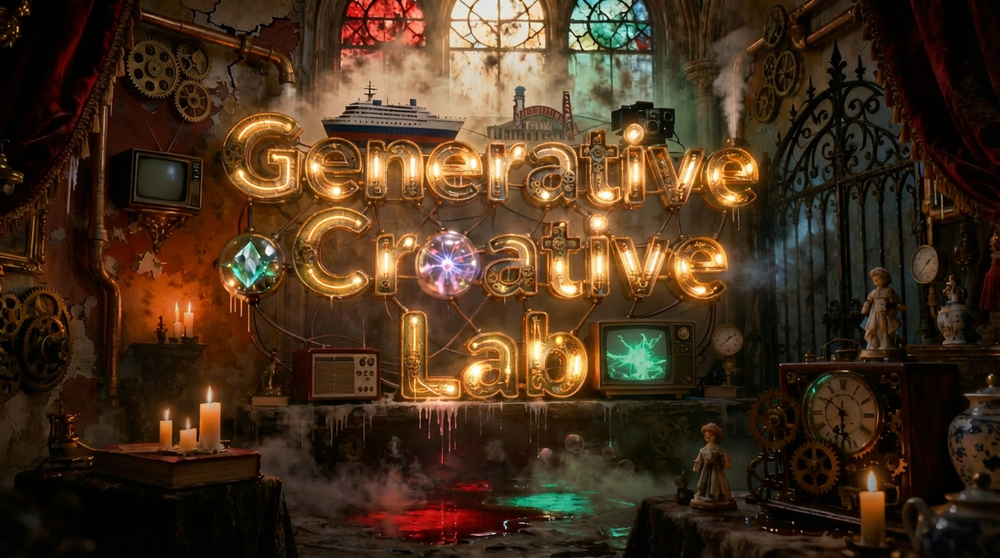

Generative Creative Lab Documentation
=====================================

A modular framework for creative development, exploration, and experimentation using generative AI.

Generative Creative Lab is a flexible platform designed for creative experimentation with
generative AI models. Built on Django and Celery, it provides a modular architecture
for multi-model diffusion image generation, dynamic prompt enhancement, and systematic
creative exploration through model composition and workflow orchestration.

.. toctree::
   :maxdepth: 2
   :caption: Contents:

   guides/index
   api/index

Creative Framework Philosophy
------------------------------

Generative Creative Lab is designed as a **creative laboratory** - not merely a tool for generating images, but a comprehensive framework for exploring the intersection of different AI models, prompting strategies, and creative workflows.

Core Principles
~~~~~~~~~~~~~~~~

- **Model Modularity**: Mix and match diffusion models, LoRAs, and enhancement strategies
- **Prompt Evolution**: Transform and refine prompts using multiple enhancement approaches  
- **Workflow Orchestration**: Queue-based processing for batch experimentation
- **Extensible Architecture**: Easy to add new models, enhancement methods, and creative tools

Creative Capabilities
~~~~~~~~~~~~~~~~~~~~~

- **Generative Models**: Multiple diffusion architectures with dynamic LoRA integration
- **Creative Enhancement**: Multi-strategy prompt transformation and refinement
- **Batch Experimentation**: Systematic exploration across models and parameters
- **Development Framework**: Template method architecture for easy extension

Technical Foundation
~~~~~~~~~~~~~~~~~~~~

- **Asynchronous Processing**: Celery workers for GPU-intensive creative tasks
- **Creative Studio Interface**: Django Unfold admin for workflow management
- **Observability**: Structured JSON logging with Grafana/Loki integration
- **Configuration-Driven**: JSON-based model and style definitions with database sync

Indices and tables
==================

* :ref:`genindex`
* :ref:`modindex`
* :ref:`search`
